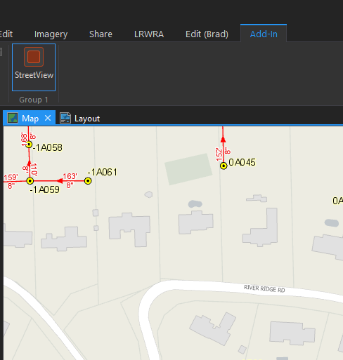
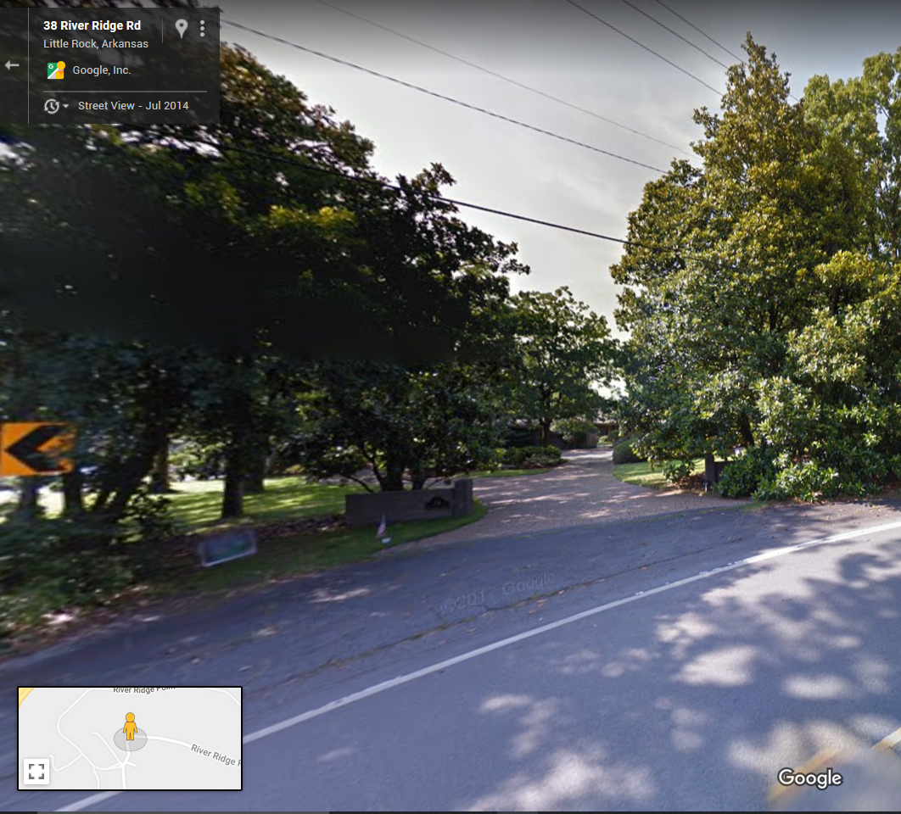

---

---

# ArcGIS-Pro-GoogleStreetView
An ArcGIS Pro add-in that opens Google Street View in the clients default browser for a location clicked on a map. This is a basic street view tool; there is no interaction between the browser and ArcGIS Pro beyond opening the browser window.  This is because the Google Maps API no longer supports use with other mapping applications.  

This tool is also apart of the larger [LRWRA add-in](https://github.com/dogwoodgeo/ArcGIS-Pro-LRWRA) 

**Note**: I am a novice .Net developer, at best.  The add-in works, but feel free to let me know if you see any code that is "wrong" or just plain bad.  

## Getting Started

Clone or download the repository. Open Visual Studio 2015 or 2017, build solution, launch ArcGIS Pro and check the **Add-Ins** tab.


### Prerequisites

```
Language:				C#
Contributor:			Bradley Jones, bjones@dogwoodgeo.com
Organization:			Little Rock Water Reclamation Authority (LRWRA)
Org Site: 				https://git.lrwu.com/portal
Date:					9/20/2018
ArcGIS Pro:				2.2
ArcGIS Pro SDK: 		2.2
Visual Studio: 			2017, 2015
.NET Target Framework:	4.6.1
```

### How To Use Add-In

1. Build add-in (see **Getting Started**)

2. Launch ArcGIS Pro.

3. Go to **Add-In** tab

4. Activate tool

   

5. Click on street location you wish to see Google Street View of.

6. Default browser windows opens with street view (if street view is available for location).

   


**NOTE**: A blank browser window will open if there is no Google Street View available for that location. No *warning* or *error* dialogs will be displayed.


